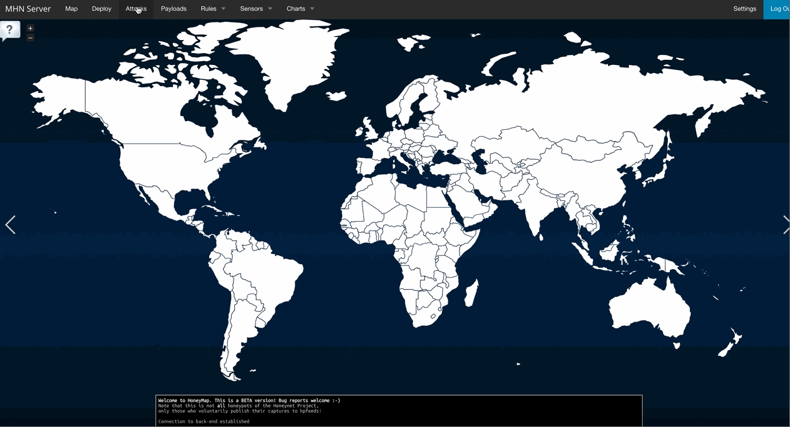
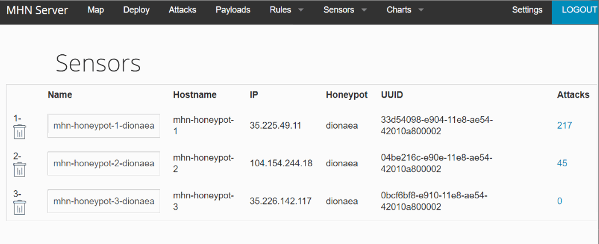

# CyberSecurity-Week10
In this project, we had to create a honeypot server, is a computer system that is set up to act as a catch cyberattackers, and to detect, or study attempts to gain unauthorized access to information system.

## Which Honeypot(s) you deployed
- mhn-honeypot-1
- mhn-honeypot-2
- mhn-honeypot-3
## Time Spent 
 12 hours 
## Any issues you encountered
 - There were lots of issues i was facing when I followed the instruction on the codepath, such as permmision deny and could not fetch resource as well as the "mhn server Killed". Later on we found out that the problem was caused by a version mismatch of the redis dependency where in order to solve it i had to manually trasnger files from one folder to the env directory. The whole process took me more than one day. 

## A summary of the data collected: number of attacks, number of malware samples, etc.
- [x] Summary:
   - Deployed Honeypots
   - [x] GIF Walkthrough: 
   - 
   - Sensor Deploy
   - [x] GIF Walkthrough: 
   - 
## Any unresolved questions raised by the data collected
 No
 
## Data

